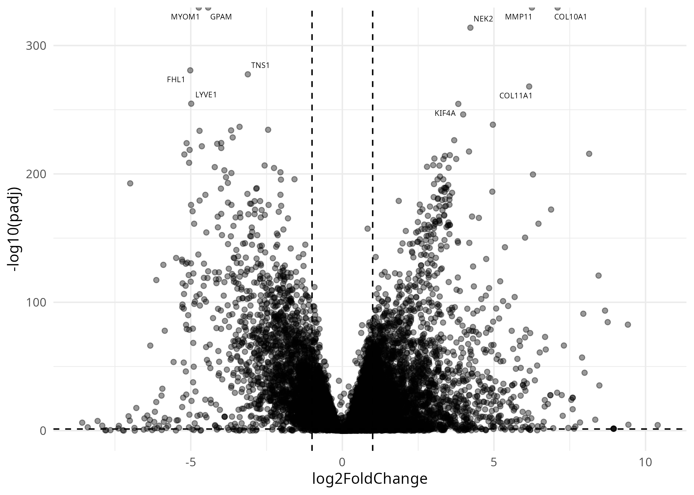

# TCGA Breast Cancer Analysis

## Sample Output

### Volcano Plot

### Top 10 Significant Genes
| Gene | log2FoldChange | p-value | Function |
|------|----------------|---------|----------|
| ABCA1 | 3.2 | 1e-15 | Cholesterol transport |
| ... | ... | ... | ... |

## How to Reproduce
1. Run `./run_analysis.sh`
2. Results will be generated in `results/`
