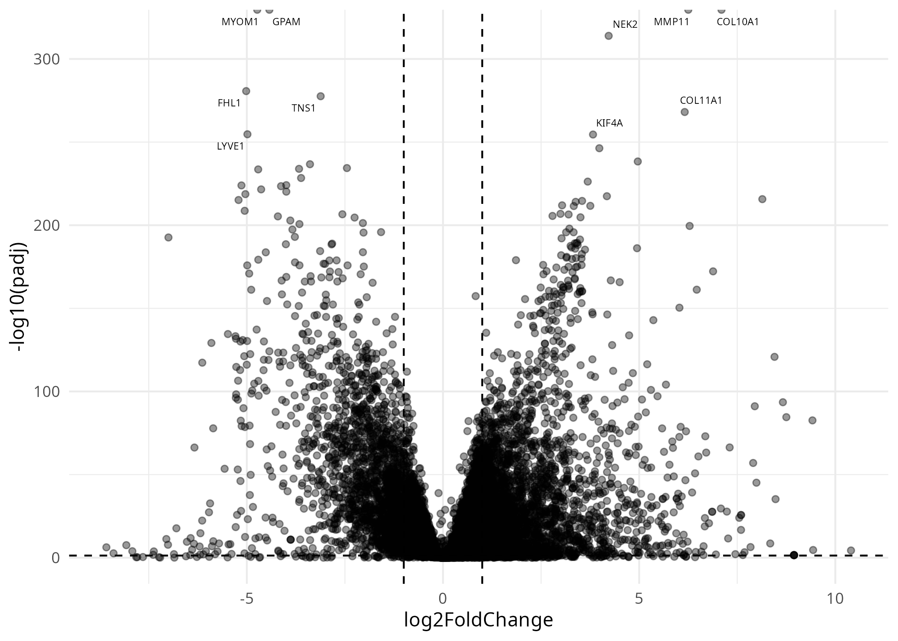
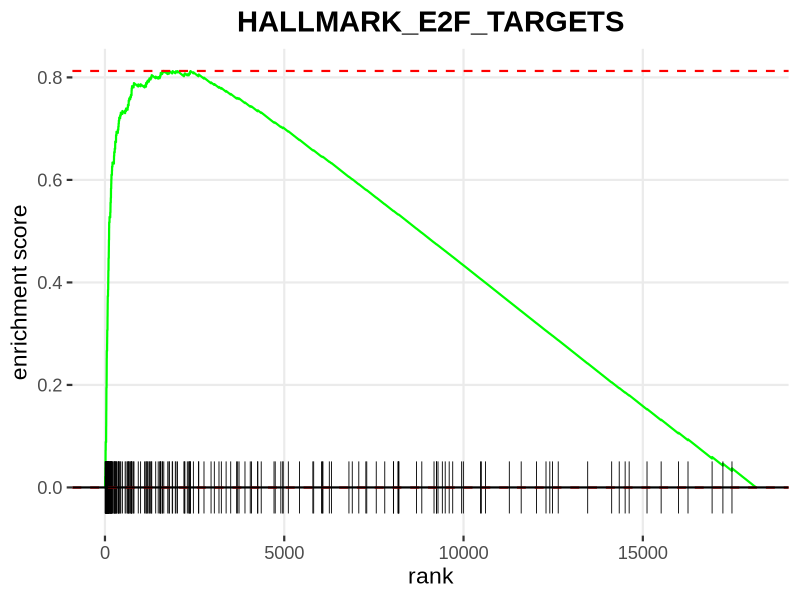
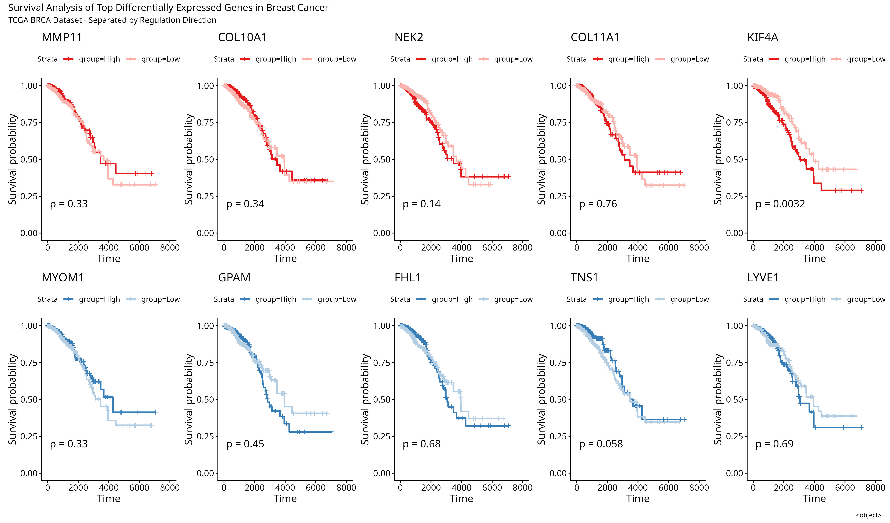
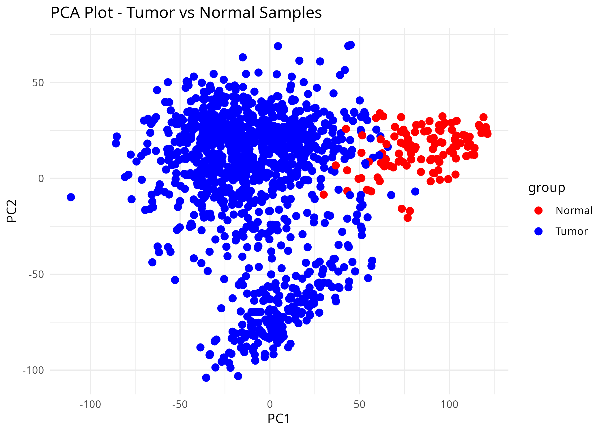

# TCGA Breast Cancer (BRCA) RNA-seq Analysis Pipeline

**Author:** Merlin Dassanayake  
**Language:** R  
**Key Tools:** TCGAbiolinks, DESeq2, clusterProfiler, fgsea, survminer, tidyverse  
**Dataset:** [The Cancer Genome Atlas (TCGA) – BRCA cohort](https://portal.gdc.cancer.gov/projects/TCGA-BRCA)

---

## Overview

This repository presents a complete RNA-seq analysis workflow using TCGA-BRCA data.  
The pipeline performs data acquisition, quality control, differential gene expression, functional enrichment, and survival analysis.  
All scripts are fully automated and can be executed sequentially using a provided Bash script.

The project demonstrates reproducible bioinformatics practices for transcriptomic analysis in cancer research.

---

## Analysis Workflow

| Step | Script | Description |
|------|---------|-------------|
| 1 | `scripts/01_download_tcga.R` | Downloads TCGA-BRCA RNA-seq and clinical data using `TCGAbiolinks`. |
| 2 | `scripts/02_qc_eda.R` | Performs gene filtering, PCA visualization, and top-variable gene heatmap. |
| 3 | `scripts/03_deseq2_deg.R` | Runs differential expression analysis using `DESeq2` and generates volcano plots. |
| 4 | `scripts/04_enrichment.R` | Conducts GO term enrichment and Hallmark GSEA using `clusterProfiler` and `fgsea`. |
| 5 | `scripts/05_survival.R` | Links top DEGs with clinical outcomes and visualizes Kaplan–Meier survival curves. |

All steps can be executed automatically via:

```bash
bash run_analysis.sh
```

---

## Results Summary
Differential expression analysis of **~1,200 TCGA-BRCA RNA-seq samples** (Primary Tumor vs. Solid Tissue Normal) identified **~5,000 significantly dysregulated genes** (*p-adjusted < 0.05, |log₂FC| > 1*).  

Functional enrichment using `clusterProfiler` and `fgsea` revealed strong upregulation of **cell-cycle and immune-related pathways**, with the **Hallmark E2F Targets** gene set emerging as one of the top enriched pathways.   

Integration of clinical survival data identified **KIF4A** as a gene with a **significant prognostic association** (*p < 0.05*), consistent with its role in tumor cell proliferation and adverse breast cancer outcomes.  

Overall, this pipeline demonstrates a reproducible approach for large-scale cancer transcriptome analysis — from raw count data to biological and clinical insight.

---

## Example Visualizations

| Differential Expression | Enrichment Analysis |
|-------------------------|---------------------|
|  |  |
| *Volcano plot showing significantly upregulated and downregulated genes between tumor and normal samples.* | *Top enriched Hallmark gene set (**E2F Targets**) from GSEA analysis.* |

| Survival Analysis | PCA (Quality Control) |
|-------------------|-----------------------|
|  |  |
| *Kaplan–Meier survival curves for prognostic gene expression groups (high vs. low), demonstrating survival stratification.* | *Principal Component Analysis (PCA) showing clear separation between tumor and normal samples based on transcriptomic profiles.* |

---

## Environment Reproducibility

A reproducible Conda/Mamba environment is provided under `env/r-env.yml`.  
To recreate the analysis environment:

```bash
mamba env create -f env/r-env.yml
mamba activate bc-rna
```